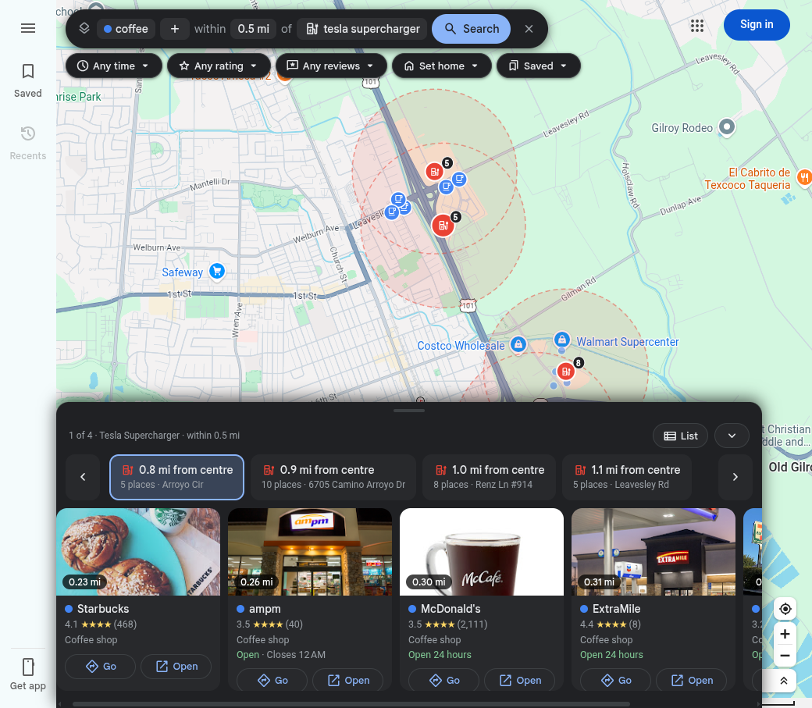

# Google Maps Layers

A userscript that answers a question Google Maps can't: **"show me X within N miles of each Y."**

> **Status: in testing.** It works and I use it, but it is still being tested and changed. Google can change the endpoint it reads at any time, which would break searches until it is updated.

Superchargers with food within half a mile. Hotels with a dog park within a mile. Gas stations with coffee next door. Maps can search for one thing at a time; this runs both searches, measures the distance from every Y to every X, and draws the result on the map.

## Why I built it

We drive a Tesla, and a Supercharger stop is 20 to 40 minutes of waiting. I wanted to pick the charger by what is around it: somewhere to eat, a coffee, a park for the dog. Google Maps makes you search each charger one at a time and eyeball the distance. This does it for every charger on the screen at once, and puts the answer in a bottom sheet big enough to use from the car.

It started as "food near Superchargers" but works for any pair: hotels near a dog park, gas next to coffee, whatever you need near whatever you are going to.

## What it does

- **Anchor + finds.** One anchor search (the Y: "tesla supercharger") and one or more find searches (the X: "food", "coffee"), each in its own colour.
- **Hubs.** Every anchor result becomes a hub with a radius disc on the map. Each hub lists the finds inside its radius, nearest first.
- **Filters**, applied live: radius (0.25 to 5 mi), minimum stars, minimum review count, and "open now / open within 1, 2 or 4 hours", worked out from each place's opening hours.
- **Bottom sheet built for the car.** A swipe-up sheet of hubs with photo cards and big touch targets, sorted by distance from home (if you set one) or from the map centre. One tap opens directions.
- **Presets**: Superchargers + food, Superchargers + coffee, Hotels + dog parks, Gas + coffee.

## How it works

The script reads the same search endpoint the Maps page itself calls when you type in the search box, so results match what Maps would show you. Nothing is sent anywhere else.

- **Paging**: Maps returns 20 results a page, ranked by relevance rather than distance, so in-range places turn up on late pages. Each search fetches pages five at a time until one comes back empty. Stopping at the first page with nothing new had kept only 33 of 54 food places within 0.5 mi.
- **Relevance trimming**: Maps pads results with loosely related places ("dog park" returns a sports bar). Category-like queries (coffee, pizza, gas station) match 76-97% of results by name or category; free-text ones (food, tacos) only 28-45%, where the rest are real answers. So results are trimmed only when more than 75% match, or when the query is in quotes. Measured on 2 areas, n=120-202 results each.
- **Payload**: the request carries a protobuf-style parameter blob. Cutting it to only the groups the script reads took a page of results from 811 kB to 510 kB while keeping name, coordinates, rating, reviews, category, photo, hours and price.
- **Rate limits**: at most 8 requests in flight and 20 hubs per run, and results are cached for 30 minutes per query and area. A 429, or Google's "unusual traffic" page, stops the run with a message instead of retrying.
- **Code layout**: one file in sections (CONST, PURE, STORE, API, ENGINE, MAP, UI, BOOT). PURE holds the distance, opening-hours and relevance logic with no DOM, so it can be tested under Node.

## Install

It runs on desktop Chrome, Edge, Firefox and Firefox-based browsers, through a userscript manager extension. Two minutes, once.

### 1. Install a userscript manager

Pick one. Violentmonkey is free and open source; Tampermonkey is the most widely used.

| Browser | Extension |
|---|---|
| Chrome, Brave | [Violentmonkey](https://chromewebstore.google.com/detail/violentmonkey/jinjaccalgkegednnccohejagnlnfdag) or [Tampermonkey](https://chromewebstore.google.com/detail/tampermonkey/dhdgffkkebhmkfjojejmpbldmpobfkfo) |
| Edge | [Violentmonkey](https://microsoftedge.microsoft.com/addons/detail/violentmonkey/eeagobfjdenkkddmbclomhiblgggliao) or [Tampermonkey](https://microsoftedge.microsoft.com/addons/detail/tampermonkey/iikmkjmpaadaobahmlepeloendndfphd) |
| Firefox, LibreWolf | [Violentmonkey](https://addons.mozilla.org/firefox/addon/violentmonkey/) or [Tampermonkey](https://addons.mozilla.org/firefox/addon/tampermonkey/) |

### 2. Chrome and Edge only: allow user scripts

Recent versions of Chrome and Edge block userscripts until you switch them on for the extension:

1. Open `chrome://extensions` (or `edge://extensions`).
2. Click **Details** on Violentmonkey or Tampermonkey.
3. Turn on **Allow User Scripts**. On older versions that have no such toggle, turn on **Developer mode** at the top right of the extensions page instead.

Firefox needs nothing extra.

### 3. Install the script

Open **[gmaps-layers.user.js](https://raw.githubusercontent.com/JPInert/gmaps-layers/main/gmaps-layers.user.js)**. The extension recognises the `.user.js` file and shows an install page; click **Install** (or **Confirm installation**).

### 4. Use it

1. Open [Google Maps](https://www.google.com/maps) (reload it if it was already open) and move the map to the area you care about.
2. A bar appears at the top: **[find] within [0.5 mi] of [anchor]**. Click each part to change it, or pick a preset from **Saved**.
3. Click **Search**. Radius circles appear around each anchor, and the bottom sheet lists what is inside each one, nearest first. Use **Go** for directions.
4. The filter chips (time, rating, reviews) apply instantly with no new search. **Set home** sorts the anchors by distance from your home instead of the map centre.

To update later, the extension checks for new versions on its own, or open the install link again. To remove it, delete it from the extension's dashboard.

## Testing

`test/smoke.mjs` loads Google Maps in headless Chromium, runs the published script, searches "coffee within 0.5 mi of tesla supercharger" in a small town and checks that the anchors come back with places inside their radius. Last run, 2026-10-05: 4 anchors, 5 / 10 / 8 / 5 places in range, PASS. The screenshot above is from that run. Day to day I run it in Violentmonkey on a Firefox-based browser; Tampermonkey and Chrome's "Allow User Scripts" path have not been checked by hand yet.

## A note on Google's terms

This uses an undocumented endpoint, not the paid Places API, and Google's terms don't allow automated access to Maps. It is a personal tool: read-only, rate-limited, and it runs only in a browser where you are already using Maps. Use it the same way.

## Built with Claude Code

I designed and built this with Claude Code as my pair, including the request capture, the payload trimming and the relevance measurements above.

## License

MIT
